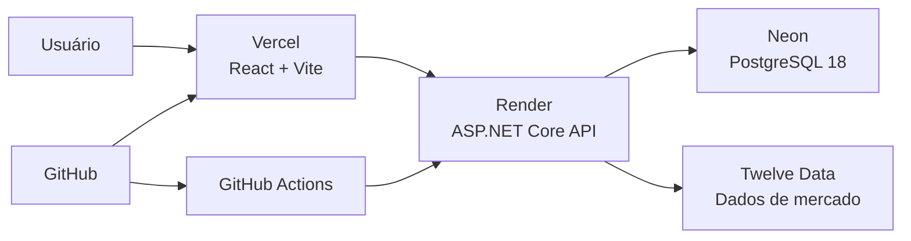

# VI Impact

[](https://github.com/JrCotrim/VI-Impact/actions/workflows/ci.yml)
[](https://vi-impact.vercel.app)
[](https://vi-impact-api.onrender.com/health/ready)


Aplicação full-stack que relaciona eventos públicos ligados ao **GTA VI** com movimentações das ações da **Take-Two Interactive (`TTWO`)**.

O projeto reúne dados de mercado, catálogo de eventos, comparação com o benchmark **QQQ**, visualizações interativas, persistência em PostgreSQL, tratamento de falhas, testes automatizados, containers e deploy completo em nuvem.

> Projeto educacional e de portfólio. As informações exibidas não constituem recomendação de investimento.

---

## Demonstração online

| Serviço | Endereço |
|---|---|
| Dashboard | [https://vi-impact.vercel.app](https://vi-impact.vercel.app) |
| API | [https://vi-impact-api.onrender.com](https://vi-impact-api.onrender.com) |
| Health Check | [https://vi-impact-api.onrender.com/health/ready](https://vi-impact-api.onrender.com/health/ready) |

A infraestrutura de produção utiliza:

- **Vercel** para o frontend React;
- **Render** para a API ASP.NET Core;
- **Neon** para o PostgreSQL 18;
- **Twelve Data** como fonte dos dados de mercado.

No plano gratuito atualmente utilizado no Render, o primeiro acesso pode demorar mais por causa do cold start. A coleta em segundo plano também depende de a instância da API estar ativa.

---

## Visão geral

O VI Impact permite:

- acompanhar cotação, variação diária e volume negociado da TTWO;
- visualizar o histórico de preços em diferentes períodos;
- comparar o desempenho da TTWO com o ETF QQQ;
- posicionar eventos relacionados ao GTA VI sobre o gráfico;
- calcular retornos observados após cada evento;
- medir retorno excedente em relação ao benchmark;
- ordenar e filtrar eventos pelo impacto;
- consultar detalhes, categorias e fontes;
- alternar entre os temas claro e noturno;
- executar a aplicação localmente, com Docker ou em nuvem.

A aplicação não afirma que um evento causou determinada movimentação. Ela apresenta uma análise temporal dos dados disponíveis.

---

## Dashboard

O dashboard possui:

- cards de preço atual, variação diária, volume e última atualização;
- mini gráficos de preço e volume;
- gráfico interativo com períodos de `1D` até `Máx.`;
- seleção de período personalizado;
- comparação normalizada entre TTWO e QQQ;
- zoom, navegação e preservação do estado do gráfico;
- marcadores de eventos sobre a série histórica;
- linha do tempo com filtros;
- ranking completo de impacto;
- análise em 1, 5 e 30 pregões;
- filtros por direção, categoria e pesquisa;
- painel detalhado de cada evento;
- estados de carregamento, indisponibilidade e nova tentativa.

---

## Principais funcionalidades

### Dados de mercado

- integração com a API da Twelve Data;
- consulta da cotação mais recente;
- coleta automática de cotações;
- persistência no PostgreSQL;
- prevenção de registros duplicados;
- consulta de histórico armazenado;
- consulta de séries temporais;
- cache das séries históricas;
- comparação com o benchmark QQQ.

A cotação atual é consultada diretamente no provedor. O worker em segundo plano é responsável por salvar periodicamente as cotações no banco.

### Análise de impacto

Para cada evento elegível, a aplicação pode calcular:

- retorno no mesmo pregão;
- retorno após 1 pregão;
- retorno após 5 pregões;
- retorno após 30 pregões;
- variação de volume;
- retorno do QQQ nos mesmos intervalos;
- retorno excedente da TTWO em relação ao benchmark;
- pregão efetivamente utilizado na análise;
- disponibilidade ou indisponibilidade dos dados necessários.

### Catálogo de eventos

- eventos relacionados ao GTA VI;
- título e descrição;
- categoria e subcategoria;
- prioridade;
- tipo e nome da fonte;
- data do acontecimento;
- data de publicação;
- precisão da data;
- status do evento;
- indicação de fonte oficial;
- elegibilidade para análise de impacto;
- link para a publicação original;
- sincronização automática do catálogo na inicialização.

### Resiliência

A integração com o provedor de mercado possui:

- timeout por tentativa;
- repetição automática de falhas transitórias;
- atraso exponencial com jitter;
- suporte ao cabeçalho `Retry-After`;
- tratamento específico de rate limit;
- circuit breaker;
- cache de respostas;
- bloqueio de requisições duplicadas simultâneas;
- logs estruturados;
- respostas seguras para o frontend.

### Tratamento de erros

A API utiliza o padrão `ProblemDetails` e retorna campos como:

```json
{
  "type": "https://httpstatuses.com/503",
  "title": "Provedor temporariamente indisponível",
  "status": 503,
  "detail": "Não foi possível consultar os dados de mercado neste momento.",
  "instance": "/api/stocks/TTWO/time-series",
  "errorCode": "provider_unavailable",
  "traceId": "identificador-da-requisicao"
}
```

O frontend interpreta erros como `429`, `502`, `503` e `504`, preserva dados anteriores quando possível e apresenta uma opção de nova tentativa.

---

## Arquitetura de produção



Fluxo principal:

1. o frontend hospedado na Vercel consulta a API;
2. a API lê e grava dados no PostgreSQL do Neon;
3. a API consulta cotações e séries históricas na Twelve Data;
4. migrations e catálogo de eventos são sincronizados na inicialização;
5. o Render publica novas versões após a aprovação dos checks da CI;
6. a Vercel cria novos deployments a partir do repositório.

---

## Estrutura do repositório

```text
VI-Impact
├── VIImpact.API
├── VIImpact.Application
├── VIImpact.Domain
├── VIImpact.Infrastructure
├── VIImpact.Tests
├── VIImpact.Web
├── .github
│   └── workflows
├── docker-compose.yml
├── .env.example
└── README.md
```

### `VIImpact.API`

Responsável por:

- controllers e rotas HTTP;
- configuração e injeção de dependência;
- tratamento global de erros;
- Health Checks;
- worker de coleta automática;
- CORS;
- inicialização, migration e seed.

### `VIImpact.Application`

Responsável por:

- interfaces;
- modelos de aplicação;
- serviços e regras de negócio;
- cálculo de impacto;
- comparação com benchmark;
- cache do ranking.

### `VIImpact.Domain`

Contém as entidades centrais do domínio:

- cotações;
- eventos do GTA VI;
- categorias;
- prioridades;
- tipos de fonte;
- demais tipos relacionados.

### `VIImpact.Infrastructure`

Responsável por:

- Entity Framework Core;
- provedor Npgsql;
- PostgreSQL;
- repositórios;
- integração com a Twelve Data;
- políticas de resiliência;
- migrations;
- seed do catálogo de eventos.

### `VIImpact.Tests`

Contém testes automatizados para:

- cálculo de impacto;
- retornos em diferentes janelas;
- comparação com benchmark;
- cache do ranking;
- integração resiliente;
- rate limit e circuit breaker;
- tratamento global de exceções;
- Health Check do PostgreSQL.

### `VIImpact.Web`

Frontend construído com React, TypeScript e Vite.

No ambiente Docker, os arquivos estáticos são servidos pelo Nginx, que também encaminha as rotas locais `/api` e `/health` para a API.

---

## Tecnologias

### Backend

- C#;
- .NET 10;
- ASP.NET Core Web API;
- Entity Framework Core;
- Npgsql;
- PostgreSQL 18;
- xUnit;
- HttpClient;
- Background Services;
- ProblemDetails;
- Health Checks.

### Frontend

- React 19;
- TypeScript;
- Vite 8;
- Recharts;
- ESLint;
- Nginx.

### Infraestrutura

- Docker;
- Docker Compose;
- GitHub Actions;
- Neon;
- Render;
- Vercel;
- Git;
- GitHub.

---

## Principais endpoints

Base da API em produção:

```text
https://vi-impact-api.onrender.com
```

### Dashboard

```http
GET /api/dashboard/TTWO?includeGtaEvents=true&limit=500
```

### Cotação atual

```http
GET /api/stocks/TTWO
```

### Histórico armazenado

```http
GET /api/stocks/TTWO/history?limit=100
```

### Série histórica

```http
GET /api/stocks/TTWO/time-series?period=1Y
```

### Eventos

```http
GET /api/gtaevents
```

### Detalhes de impacto

```http
GET /api/gtaevents/{eventId}/impact?symbol=TTWO&benchmarkSymbol=QQQ
```

### Ranking de impacto

```http
GET /api/gtaevents/impact-ranking?symbol=TTWO&benchmarkSymbol=QQQ
```

### Health Checks

```http
GET /health/live
GET /health/ready
```

- `/health/live` confirma que o processo da API está respondendo;
- `/health/ready` também verifica a conexão com o PostgreSQL.

Exemplo de resposta do endpoint de prontidão:

```json
{
  "status": "healthy",
  "checks": [
    {
      "name": "postgresql",
      "status": "healthy",
      "description": "PostgreSQL connection is available."
    }
  ]
}
```

---

## Executar com Docker

### Requisitos

- Docker Desktop;
- virtualização habilitada;
- WSL 2 no Windows;
- chave da Twelve Data.

### 1. Clone o repositório

```powershell
git clone https://github.com/JrCotrim/VI-Impact.git
cd VI-Impact
```

### 2. Crie o arquivo de ambiente

```powershell
Copy-Item .env.example .env
```

Preencha pelo menos:

```env
POSTGRES_PASSWORD=UMA_SENHA_FORTE
TWELVE_DATA_API_KEY=SUA_CHAVE_DA_TWELVE_DATA
```

Os demais valores possuem padrões adequados para o ambiente local:

```env
POSTGRES_USER=viimpact
POSTGRES_DB=VIImpactDb
POSTGRES_PORT=5432

API_PORT=5170
WEB_PORT=5173

CORS_ALLOWED_ORIGINS=http://localhost:5173

TWELVE_DATA_BASE_URL=https://api.twelvedata.com
STOCK_COLLECTION_ENABLED=true
STOCK_SYMBOL=TTWO
STOCK_INTERVAL_MINUTES=5

VITE_API_BASE_URL=
```

O arquivo `.env` está ignorado pelo Git e não deve ser versionado.

### 3. Inicie os serviços

```powershell
docker compose up -d --build
```

### 4. Verifique os containers

```powershell
docker compose ps
```

Serviços locais:

| Serviço | Endereço |
|---|---|
| Frontend | `http://localhost:5173` |
| API | `http://localhost:5170` |
| PostgreSQL | `localhost:5432` |

### 5. Teste a aplicação

```powershell
curl.exe -i "http://localhost:5170/health/ready"
curl.exe -i "http://localhost:5173/health/ready"
```

### 6. Encerre os containers

```powershell
docker compose down
```

O volume `postgres-data` preserva os dados do PostgreSQL.

Para remover também os dados:

```powershell
docker compose down -v
```

---

## Executar sem Docker

### Requisitos

- .NET SDK 10;
- Node.js;
- PostgreSQL 18;
- chave da Twelve Data.

### 1. Prepare o PostgreSQL

Crie um banco e um usuário compatíveis com a connection string que será utilizada pela API.

Exemplo local:

```text
Database: VIImpactDb
Username: viimpact
Port: 5432
```

### 2. Configure a conexão no terminal

No PowerShell:

```powershell
$env:ConnectionStrings__DefaultConnection = `
  "Host=localhost;Port=5432;Database=VIImpactDb;Username=viimpact;Password=SUA_SENHA;SSL Mode=Disable"
```

### 3. Configure a chave da Twelve Data

```powershell
dotnet user-secrets set `
  "TwelveData:ApiKey" `
  "SUA_CHAVE_AQUI" `
  --project .\VIImpact.API\VIImpact.API.csproj
```

### 4. Execute a API

```powershell
dotnet run --project .\VIImpact.API\VIImpact.API.csproj
```

Na inicialização, a API aplica migrations pendentes e sincroniza o catálogo de eventos.

Endereço local:

```text
http://localhost:5170
```

### 5. Execute o frontend

Em outro terminal:

```powershell
cd .\VIImpact.Web
npm install
npm run dev
```

Endereço local:

```text
http://localhost:5173
```

O Vite encaminha as rotas locais `/api` e `/health` para a API.

Para remover a connection string da sessão atual do PowerShell:

```powershell
Remove-Item Env:\ConnectionStrings__DefaultConnection
```

---

## Banco de dados

O projeto utiliza PostgreSQL 18 com Entity Framework Core e Npgsql.

Na inicialização, a API:

1. cria um escopo de banco;
2. aplica migrations pendentes com `MigrateAsync`;
3. sincroniza o catálogo de eventos;
4. inicia o worker de coleta.

Tabelas principais:

```text
GtaEvents
StockQuotes
__EFMigrationsHistory
```

Ambientes utilizados:

| Ambiente | PostgreSQL |
|---|---|
| Desenvolvimento com Docker | Container `postgres:18-alpine` |
| Produção | Neon PostgreSQL 18 |

Em produção, a connection string é armazenada nas variáveis de ambiente do Render e não faz parte do repositório.

---

## Coleta automática

O worker pode ser configurado por `appsettings.json` ou por variáveis de ambiente:

```json
{
  "StockCollection": {
    "Enabled": true,
    "Symbol": "TTWO",
    "IntervalMinutes": 5
  }
}
```

Equivalentes no formato de configuração do ASP.NET Core:

```text
StockCollection__Enabled
StockCollection__Symbol
StockCollection__IntervalMinutes
```

Equivalentes usados pelo `.env` do Docker Compose:

```env
STOCK_COLLECTION_ENABLED=true
STOCK_SYMBOL=TTWO
STOCK_INTERVAL_MINUTES=5
```

O worker consulta a cotação configurada e salva apenas dados que ainda não estejam armazenados.

---

## Configuração de produção

### Neon

- PostgreSQL 18;
- banco `neondb`;
- conexão SSL;
- migrations aplicadas pelo Entity Framework Core;
- credenciais armazenadas somente no Render.

### Render

O serviço da API utiliza:

```text
Runtime: Docker
Dockerfile: VIImpact.API/Dockerfile
Port: 8080
Health Check: /health/ready
```

Variáveis principais:

```text
ASPNETCORE_ENVIRONMENT=Production
ASPNETCORE_FORWARDEDHEADERS_ENABLED=true
PORT=8080

ConnectionStrings__DefaultConnection=CONNECTION_STRING_DO_NEON
Cors__AllowedOrigins=https://vi-impact.vercel.app

TwelveData__ApiKey=CHAVE_DA_TWELVE_DATA
TwelveData__BaseUrl=https://api.twelvedata.com

StockCollection__Enabled=true
StockCollection__Symbol=TTWO
StockCollection__IntervalMinutes=5
```

Segredos não devem conter aspas externas nem ser enviados ao repositório.

### Vercel

Configuração do frontend:

```text
Framework: Vite
Root Directory: VIImpact.Web
Build Command: npm run build
Output Directory: dist
```

Variável de produção:

```text
VITE_API_BASE_URL=https://vi-impact-api.onrender.com
```

A origem autorizada no Render deve coincidir exatamente com a URL da Vercel, sem barra no final.

---

## Testes

Execute os testes do backend:

```powershell
dotnet test .\VIImpact.slnx `
  --configuration Release
```

Estado validado durante o desenvolvimento:

```text
18 testes
0 falhas
```

As principais áreas cobertas são:

- cálculo de impacto;
- retornos em diferentes janelas;
- comparação com benchmark;
- cache;
- timeout e repetição;
- rate limit;
- circuit breaker;
- respostas `ProblemDetails`;
- Health Check do PostgreSQL.

---

## Build e qualidade do frontend

```powershell
cd .\VIImpact.Web
npm install
npm run lint
npm run build
```

---

## Integração contínua

O workflow está localizado em:

```text
.github/workflows/ci.yml
```

Jobs atuais:

```text
Backend build and tests
Frontend lint and build
Validate Docker Compose
```

Cada execução valida:

- restore do backend;
- build em modo `Release`;
- testes automatizados;
- lint do frontend;
- build do frontend;
- sintaxe e interpolação do Docker Compose.

O Render está configurado para publicar a API depois que os checks da CI forem aprovados.

---

## Segurança

- a chave da Twelve Data não fica no código;
- a connection string de produção não fica no repositório;
- o `.env` não é versionado;
- os valores usados na CI são fictícios;
- mensagens internas de exceção não são expostas ao cliente;
- o `traceId` permite correlacionar respostas com os logs;
- CORS restringe as origens autorizadas;
- a API executa no container com usuário sem privilégios;
- senhas e chaves são configuradas nas plataformas de deploy.

---

## Status

O projeto possui um MVP full-stack funcional e publicado com:

- backend em camadas;
- dashboard interativo;
- PostgreSQL;
- catálogo de eventos;
- análise de impacto;
- comparação com benchmark;
- persistência;
- cache e resiliência;
- tratamento padronizado de erros;
- Health Checks;
- testes automatizados;
- Docker Compose;
- integração contínua;
- frontend publicado na Vercel;
- API publicada no Render;
- banco publicado no Neon.

Próximas evoluções possíveis:

- autenticação e autorização;
- painel administrativo de eventos;
- testes de integração com banco;
- observabilidade com métricas e tracing;
- coleta independente de instâncias que entram em suspensão;
- suporte a novos ativos e benchmarks;
- domínio personalizado.

---

## Objetivo do projeto

O VI Impact foi desenvolvido para aprendizado e composição de portfólio, aplicando na prática:

- arquitetura em camadas;
- injeção de dependência;
- integração com APIs externas;
- persistência de dados;
- migrations;
- processamento em segundo plano;
- cache;
- resiliência;
- análise de séries temporais;
- testes automatizados;
- containerização;
- integração contínua;
- deploy em nuvem;
- configuração segura por ambiente;
- boas práticas com Git e GitHub.

---

## Autor

Desenvolvido por **Júnior Cotrim**.

GitHub: [@JrCotrim](https://github.com/JrCotrim)

---

## Aviso

Este projeto possui finalidade educacional e de portfólio.

Os dados financeiros podem apresentar atraso, indisponibilidade ou diferenças em relação a outras fontes. Os movimentos observados não comprovam causalidade e não devem ser interpretados como recomendação de investimento.
