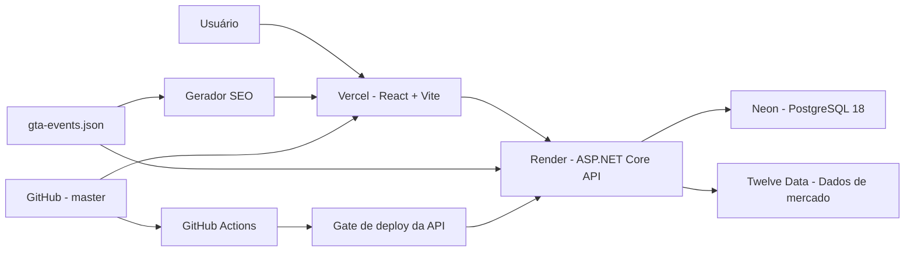

# VI Impact

[](https://github.com/JrCotrim/VI-Impact/actions/workflows/ci.yml)
[](https://vi-impact.vercel.app)
[](https://vi-impact-api.onrender.com/health/ready)


O **VI Impact** relaciona eventos públicos relevantes do **GTA VI** com movimentos observados nas ações da **Take-Two Interactive (`TTWO`)**, usando o **QQQ** como referência de mercado.

A aplicação combina um catálogo editorial de eventos, dados financeiros e análises por pregão para mostrar como a TTWO se comportou ao redor de anúncios, trailers, adiamentos, vazamentos e outros acontecimentos públicos — sem afirmar que um evento foi a causa direta da variação.

> Projeto educacional e de portfólio. Não constitui recomendação de investimento.

## Acesse o projeto

| Serviço | Link |
|---|---|
| Dashboard | [vi-impact.vercel.app](https://vi-impact.vercel.app) |
| API | [vi-impact-api.onrender.com](https://vi-impact-api.onrender.com) |
| Health Check | [health/ready](https://vi-impact-api.onrender.com/health/ready) |

A API utiliza o plano gratuito do Render. O primeiro acesso após um período de inatividade pode levar alguns segundos.

---

## Funcionalidades

- cotação, variação diária e volume da TTWO;
- histórico interativo com períodos de `1D` até `Máx.` e período personalizado;
- comparação normalizada entre TTWO e QQQ;
- marcadores de eventos sincronizados com gráfico e linha do tempo;
- navegação direta por URL canônica em `/events/<slug>`;
- preview resumido e análise completa de cada evento;
- mini gráficos e métricas de reação em 1, 5 e 30 pregões;
- comparação TTWO × QQQ e cálculo de retorno excedente;
- estados distintos para métricas pendentes, dados indisponíveis e falhas recuperáveis;
- ranking por impacto, data, direção, categoria e pesquisa;
- compartilhamento por link canônico, Clipboard API e Web Share API;
- fontes originais e classificação editorial dos eventos;
- temas claro e noturno;
- layout responsivo para desktop e mobile;
- carregamento sob demanda do gráfico principal;
- coleta automática de cotações;
- tratamento de timeout, rate limit, circuit breaker e novas tentativas;
- SEO técnico com canonical, Open Graph, Twitter Card, JSON-LD, `robots.txt` e sitemap;
- geração de HTML estático com metadata específica para eventos ocorridos;
- sincronização de metadata durante navegação client-side sem reload.

---

## Análise de impacto

Para cada evento elegível, a aplicação identifica o pregão correspondente e calcula:

- retorno no mesmo pregão;
- retorno após 1, 5 e 30 pregões;
- variação de volume;
- retorno do QQQ nos mesmos intervalos;
- retorno excedente da TTWO em relação ao benchmark.

```text
Retorno excedente = Retorno da TTWO - Retorno do QQQ
```

Quando ainda não existem pregões completos suficientes após um evento recente, a interface apresenta o horizonte como **pendente**, em vez de interpretar ausência de dados como retorno zero ou erro.

A comparação com o QQQ ajuda a contextualizar movimentos da ação em relação ao mercado mais amplo. O resultado representa **correlação temporal, não causalidade**.

---

## Tecnologias

| Área | Tecnologias |
|---|---|
| Backend | C#, .NET 10, ASP.NET Core, Entity Framework Core, Npgsql |
| Banco | PostgreSQL 18 |
| Frontend | React 19, TypeScript 6, Vite 8, Recharts |
| Testes backend | xUnit |
| Testes frontend | Vitest, Testing Library, jsdom |
| Infraestrutura | Docker, Docker Compose, Nginx, GitHub Actions |
| Produção | Vercel, Render e Neon |
| Dados de mercado | Twelve Data |

---

## Arquitetura



Fluxo principal:

1. o frontend consulta a API pública para dados do dashboard, séries históricas e análises;
2. a API lê dados persistidos no PostgreSQL e consulta a Twelve Data quando necessário;
3. migrations pendentes e o catálogo canônico de eventos são sincronizados na inicialização;
4. o worker coleta periodicamente a cotação configurada enquanto a API está ativa;
5. o build do frontend gera páginas SEO estáticas para eventos ocorridos e atualiza o sitemap;
6. durante navegação SPA, o frontend mantém `title`, description, canonical, Open Graph, Twitter e JSON-LD sincronizados com a rota;
7. a CI valida backend, frontend e o stack Docker antes do deploy da API.

---

## Organização do código

```text
VI-Impact
├── VIImpact.API
├── VIImpact.Application
├── VIImpact.Domain
├── VIImpact.Infrastructure
│   └── Data
│       └── Seed
│           └── gta-events.json
├── VIImpact.Tests
├── VIImpact.Web
│   ├── public
│   ├── scripts
│   │   └── generate-seo.mjs
│   └── src
├── .github
│   └── workflows
│       └── ci.yml
├── docker-compose.yml
├── .env.example
└── README.md
```

| Projeto | Responsabilidade |
|---|---|
| `VIImpact.API` | API HTTP, configuração, CORS, Health Checks, tratamento de erros e worker |
| `VIImpact.Application` | Casos de uso, contratos e análise de impacto |
| `VIImpact.Domain` | Entidades e tipos centrais do domínio |
| `VIImpact.Infrastructure` | PostgreSQL, repositórios, migrations, catálogo de eventos e Twelve Data |
| `VIImpact.Tests` | Testes automatizados do backend |
| `VIImpact.Web` | Dashboard React, testes frontend, rotas canônicas e geração SEO |

---

## Decisões técnicas

### PostgreSQL e catálogo de eventos

A aplicação utiliza PostgreSQL 18 com Entity Framework Core e Npgsql.

Na inicialização, a API:

1. aplica migrations pendentes;
2. sincroniza o catálogo canônico de eventos;
3. inicia o worker de coleta.

| Ambiente | Banco |
|---|---|
| Desenvolvimento com Docker | `postgres:18-alpine` |
| Produção | Neon PostgreSQL 18 |

O catálogo editorial fica em:

```text
VIImpact.Infrastructure/Data/Seed/gta-events.json
```

Ele também é a fonte usada pelo gerador de páginas SEO, evitando uma segunda lista manual de eventos no frontend.

### Coleta automática

Um `BackgroundService` consulta periodicamente a cotação configurada e salva apenas registros ainda não armazenados.

Configuração padrão:

```json
{
  "StockCollection": {
    "Enabled": true,
    "Symbol": "TTWO",
    "IntervalMinutes": 5
  }
}
```

O worker executa dentro do processo da API. Em ambientes que suspendem a instância por inatividade, a coleta também fica suspensa.

### Resiliência da Twelve Data

A integração com a Twelve Data possui:

- timeout por tentativa;
- repetição de falhas transitórias;
- atraso exponencial com jitter;
- suporte a `Retry-After`;
- tratamento de rate limit;
- circuit breaker;
- cache de séries históricas;
- cancelamento por `CancellationToken`;
- logs estruturados.

O frontend interpreta respostas recuperáveis como `429`, `502`, `503` e `504`, preserva dados anteriores quando possível e oferece nova tentativa.

### Segurança e configuração

A API possui validação **fail-fast** para configuração necessária ao iniciar:

- connection string do PostgreSQL;
- origem permitida por CORS;
- chave e URL base da Twelve Data;
- limites de timeout, retry e circuit breaker;
- configuração do coletor automático.

Outras proteções aplicadas:

- CORS por allowlist de origens;
- em produção, origens CORS precisam usar HTTPS;
- CORS público permite apenas método `GET`;
- API pública exposta atualmente é read-only;
- símbolos aceitos pela API pública são limitados a `TTWO` e `QQQ`;
- header `X-Content-Type-Options: nosniff`;
- header de identificação do Kestrel removido;
- secrets e connection strings ficam fora do repositório;
- HTTPS público é terminado pelo provedor de hospedagem, enquanto o container da API escuta HTTP internamente.

### Tratamento de erros

A API utiliza `ProblemDetails` e inclui um `traceId` para correlação de falhas:

```json
{
  "type": "https://httpstatuses.com/503",
  "title": "Provedor temporariamente indisponível",
  "status": 503,
  "detail": "Não foi possível consultar os dados de mercado neste momento.",
  "errorCode": "provider_unavailable",
  "traceId": "identificador-da-requisicao"
}
```

---

## SEO e compartilhamento social

A camada de SEO foi projetada para funcionar tanto no HTML servido inicialmente quanto durante a navegação da SPA.

### Dashboard

O `index.html` define metadata base em `pt-BR`:

- `title` e meta description;
- canonical;
- Open Graph;
- Twitter Card;
- JSON-LD `WebSite`;
- `robots`;
- imagem social `1200×630`.

### Eventos

O build do frontend executa:

```text
npm run build
├── tsc -b
├── vite build
└── npm run seo:generate
```

O script `VIImpact.Web/scripts/generate-seo.mjs`:

1. lê o catálogo `gta-events.json`;
2. considera apenas eventos com status ocorrido;
3. valida slugs canônicos e duplicidades;
4. gera `dist/events/<slug>.html`;
5. injeta metadata específica por evento;
6. atualiza `dist/sitemap.xml`.

A descrição SEO prioriza `summary` e usa `description` como fallback, com limite de 160 caracteres.

Durante navegação por `pushState`, fechamento da análise ou Back/Forward, `src/utils/seoMetadata.ts` sincroniza no cliente:

- `document.title`;
- meta description;
- canonical;
- `og:title`, `og:description` e `og:url`;
- `twitter:title` e `twitter:description`;
- JSON-LD.

### Estado validado em produção

Em 23 de agosto de 2026, a validação de produção confirmou:

```text
robots.txt: 200
sitemap.xml: 200
URLs no sitemap: 45
Páginas de eventos: 44
og-image.png: 1200x630, image/png
44/44 páginas de evento com metadata validada
```

---

## Principais endpoints

Base de produção:

```text
https://vi-impact-api.onrender.com
```

| Recurso | Endpoint |
|---|---|
| Dashboard | `GET /api/dashboard/TTWO?includeGtaEvents=true&limit=500` |
| Cotação atual | `GET /api/stocks/TTWO` |
| Histórico armazenado | `GET /api/stocks/TTWO/history?limit=100` |
| Série histórica | `GET /api/stocks/TTWO/time-series?period=1Y` |
| Eventos | `GET /api/gtaevents` |
| Impacto de um evento | `GET /api/gtaevents/{eventId}/impact?symbol=TTWO&benchmarkSymbol=QQQ` |
| Ranking de impacto | `GET /api/gtaevents/impact-ranking?symbol=TTWO&benchmarkSymbol=QQQ` |
| Processo da API | `GET /health/live` |
| API e PostgreSQL | `GET /health/ready` |

A API pública limita símbolos de mercado a `TTWO` e `QQQ`.

---

## Configuração

### Ambiente local com Docker

O `.env.example` contém as variáveis esperadas. Para iniciar localmente, as duas credenciais obrigatórias são:

```env
POSTGRES_PASSWORD=UMA_SENHA_FORTE
TWELVE_DATA_API_KEY=SUA_CHAVE_DA_TWELVE_DATA
```

Também podem ser configurados:

| Variável | Uso |
|---|---|
| `POSTGRES_USER` | usuário local do PostgreSQL |
| `POSTGRES_DB` | banco local |
| `POSTGRES_PORT` | porta exposta do PostgreSQL |
| `API_PORT` | porta local da API |
| `WEB_PORT` | porta local do frontend |
| `CORS_ALLOWED_ORIGINS` | allowlist da API |
| `TWELVE_DATA_BASE_URL` | endpoint do provedor |
| `TWELVE_DATA_REQUEST_TIMEOUT_SECONDS` | timeout por tentativa |
| `TWELVE_DATA_MAX_RETRY_ATTEMPTS` | quantidade máxima de retries |
| `TWELVE_DATA_RETRY_BASE_DELAY_MILLISECONDS` | atraso base dos retries |
| `TWELVE_DATA_MAXIMUM_RETRY_DELAY_SECONDS` | teto de atraso |
| `TWELVE_DATA_CIRCUIT_BREAKER_FAILURE_THRESHOLD` | limiar do circuit breaker |
| `TWELVE_DATA_CIRCUIT_BREAKER_DURATION_SECONDS` | duração do circuito aberto |
| `STOCK_COLLECTION_ENABLED` | ativa ou desativa o worker |
| `STOCK_SYMBOL` | símbolo coletado automaticamente |
| `STOCK_INTERVAL_MINUTES` | intervalo do worker |
| `VITE_API_BASE_URL` | URL base da API usada pelo frontend |

O arquivo `.env` é ignorado pelo Git e não deve ser commitado.

### Produção

Secrets e connection strings são configurados diretamente nas plataformas de hospedagem.

Entre as configurações relevantes da API estão:

```text
ConnectionStrings__DefaultConnection
Cors__AllowedOrigins
TwelveData__ApiKey
TwelveData__BaseUrl
StockCollection__Enabled
StockCollection__Symbol
StockCollection__IntervalMinutes
```

No frontend, `VITE_API_BASE_URL` define a API consumida pelo build de produção.

---

## Executar localmente

### Requisitos

Para o stack completo via Docker:

- Docker Desktop;
- virtualização/WSL 2 habilitados quando aplicável no Windows;
- chave da Twelve Data.

Para executar validações fora dos containers:

- .NET SDK 10;
- Node.js 24;
- npm.

### 1. Clone o repositório

```powershell
git clone https://github.com/JrCotrim/VI-Impact.git
cd VI-Impact
```

### 2. Crie o arquivo de ambiente

```powershell
Copy-Item .env.example .env
```

Preencha pelo menos:

```env
POSTGRES_PASSWORD=UMA_SENHA_FORTE
TWELVE_DATA_API_KEY=SUA_CHAVE_DA_TWELVE_DATA
```

### 3. Inicie a aplicação

```powershell
docker compose up -d --build
```

| Serviço | Endereço |
|---|---|
| Frontend | `http://localhost:5173` |
| API | `http://localhost:5170` |
| PostgreSQL | `localhost:5432` |

O Nginx do container web encaminha `/api` e `/health` para a API e aplica cache imutável aos assets versionados.

### 4. Verifique a execução

```powershell
docker compose ps
curl.exe -i "http://localhost:5170/health/ready"
curl.exe -i "http://localhost:5170/api/gtaevents"
```

### 5. Encerre os serviços

```powershell
docker compose down
```

Para remover também os dados locais:

```powershell
docker compose down -v
```

---

## Testes e qualidade

### Backend

```powershell
dotnet restore .\VIImpact.slnx
dotnet build .\VIImpact.slnx --configuration Release --no-restore
dotnet test .\VIImpact.slnx --configuration Release --no-build
```

### Frontend

```powershell
cd .\VIImpact.Web
npm ci
npm run lint
npm test
npm run build
```

`npm run build` também executa a geração das páginas SEO e do sitemap.

Estado validado em 23 de agosto de 2026:

```text
Backend:  71/71 testes
Frontend: 23/23 testes
Lint:     aprovado
Build:    aprovado
SEO:      44 páginas de evento geradas
```

A cobertura inclui, entre outros pontos:

- cálculo de impacto e benchmark;
- estados pendentes;
- timeout, rate limit, retry e circuit breaker;
- cache e integração com a Twelve Data;
- `ProblemDetails`;
- Health Check do PostgreSQL;
- validação fail-fast de configuração;
- allowlist pública de símbolos;
- superfície pública read-only;
- rotas canônicas;
- compartilhamento;
- recuperação de erros;
- sincronização de metadata SEO em navegação client-side.

---

## Integração contínua

O workflow está em:

```text
.github/workflows/ci.yml
```

É executado em pushes e pull requests para `master`, além de permitir execução manual.

Jobs atuais:

### Backend build and tests

```text
dotnet restore
dotnet build --configuration Release
dotnet test --configuration Release
```

### Frontend lint, tests and build

```text
npm ci
npm run lint
npm test
npm run build
```

### Build and smoke test Docker Compose

A CI:

1. valida `docker compose config`;
2. constrói e sobe o stack com `--wait`;
3. aguarda os health checks;
4. testa `/health/ready`;
5. testa o endpoint público `/api/gtaevents`;
6. exibe logs em caso de falha;
7. executa cleanup com volumes e órfãos ao final.

O Render está configurado para publicar a API somente após os checks exigidos da CI.

---

## Deploy

| Camada | Serviço |
|---|---|
| Frontend | Vercel |
| API | Render |
| PostgreSQL | Neon |
| Dados de mercado | Twelve Data |

### Vercel

O frontend é publicado a partir da branch `master`.

O build utiliza Node.js 24, instala dependências de forma reproduzível com `npm ci`, executa o build Vite/SEO e publica `dist`.

`vercel.json` mantém suporte à navegação direta em:

```text
/events/<slug>
```

### Render

A API é publicada em container e expõe:

```text
/health/live
/health/ready
```

O container possui health check próprio e o deploy da API é gateado pelos checks da CI configurados no repositório/plataforma.

### Secrets

Chaves, senhas e connection strings não ficam versionadas. Elas são definidas nos ambientes de deploy.

---

## Limitações conhecidas

- o plano gratuito do Render pode suspender a API por inatividade;
- o primeiro acesso após a suspensão pode demorar;
- o worker só executa enquanto a instância da API está ativa;
- a chave da Twelve Data possui limites de requisição conforme o plano utilizado;
- caches em memória não são compartilhados entre múltiplas instâncias;
- páginas SEO de eventos são geradas no build, portanto novos eventos ocorridos precisam de um novo deploy para aparecer no HTML estático e no sitemap;
- a análise mostra correlação temporal, não causalidade.

Essas escolhas são adequadas ao estágio atual do projeto e podem ser revistas caso o produto exija maior escala ou disponibilidade.

---

## Próximas etapas

O produto já passou pelas fases principais de funcionalidade, UI/UX, hardening, CI/CD e SEO.

As próximas etapas planejadas são:

- **Full Events Index** — página/índice completo de eventos, deliberadamente adiada para reavaliação;
- **Performance & Production Audit** — auditoria final de bundle, assets, requisições, cache, renderização e API;
- **Accessibility Final Audit** — navegação por teclado, foco, contraste, semântica, ARIA, reduced motion e leitores de tela;
- **Final Product & Content Audit** — revisão integral de conteúdo, fontes, métricas, UX e consistência;
- **Release Candidate** — validação final de CI, produção, desktop/mobile, API, SEO, acessibilidade e repositório.

---

## Autor

Desenvolvido por **Júnior Cotrim**.

GitHub: [@JrCotrim](https://github.com/JrCotrim)

---

## Aviso

Os dados financeiros podem apresentar atraso, indisponibilidade ou diferenças em relação a outras fontes.

Os movimentos observados não comprovam causalidade e não devem ser interpretados como recomendação de investimento.
