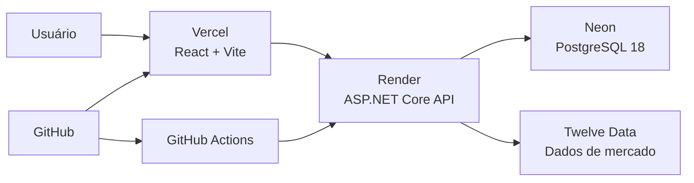

# VI Impact

[](https://github.com/JrCotrim/VI-Impact/actions/workflows/ci.yml)
[](https://vi-impact.vercel.app)
[](https://vi-impact-api.onrender.com/health/ready)


O **VI Impact** mostra como eventos públicos relacionados ao **GTA VI** coincidem com movimentações das ações da **Take-Two Interactive (`TTWO`)**.

A aplicação combina dados de mercado, um catálogo de eventos verificados e o benchmark **QQQ** para apresentar retornos observados após cada acontecimento — sem afirmar que um evento foi a causa direta da variação.

> Projeto educacional e de portfólio. Não constitui recomendação de investimento.

## Acesse o projeto

| Serviço | Link |
|---|---|
| Dashboard | [vi-impact.vercel.app](https://vi-impact.vercel.app) |
| API | [vi-impact-api.onrender.com](https://vi-impact-api.onrender.com) |
| Health Check | [health/ready](https://vi-impact-api.onrender.com/health/ready) |

A API utiliza o plano gratuito do Render. O primeiro acesso após um período de inatividade pode levar alguns segundos.

---

## Funcionalidades

- cotação, variação diária e volume da TTWO;
- histórico interativo com períodos de `1D` até `Máx.`;
- comparação normalizada entre TTWO e QQQ;
- marcadores de eventos do GTA VI sobre o gráfico;
- ranking de impacto em 1, 5 e 30 pregões;
- filtros por direção, categoria e pesquisa;
- detalhes do evento com fonte original;
- temas claro e noturno;
- coleta automática de cotações;
- tratamento de indisponibilidade, rate limit e novas tentativas.

## Análise de impacto

Para cada evento elegível, a aplicação identifica o pregão correspondente e calcula:

- retorno no mesmo pregão;
- retorno após 1, 5 e 30 pregões;
- variação de volume;
- retorno do QQQ nos mesmos intervalos;
- retorno excedente da TTWO em relação ao benchmark.

```text
Retorno excedente = Retorno da TTWO - Retorno do QQQ
```

A comparação ajuda a separar parte do movimento específico da ação de movimentos mais amplos do mercado. O resultado representa correlação temporal, não causalidade.

---

## Tecnologias

| Área | Tecnologias |
|---|---|
| Backend | C#, .NET 10, ASP.NET Core, Entity Framework Core, Npgsql |
| Banco | PostgreSQL 18 |
| Frontend | React 19, TypeScript, Vite 8, Recharts |
| Testes | xUnit |
| Infraestrutura | Docker, Docker Compose, GitHub Actions |
| Produção | Vercel, Render e Neon |
| Dados de mercado | Twelve Data |

---

## Arquitetura



Fluxo principal:

1. o frontend consulta a API;
2. a API lê e grava dados no PostgreSQL;
3. cotações e séries históricas são obtidas na Twelve Data;
4. migrations e eventos são sincronizados na inicialização;
5. a CI valida backend, frontend e Docker Compose;
6. os serviços publicam novas versões a partir do repositório.

---

## Organização do código

```text
VI-Impact
├── VIImpact.API
├── VIImpact.Application
├── VIImpact.Domain
├── VIImpact.Infrastructure
├── VIImpact.Tests
├── VIImpact.Web
├── .github
│   └── workflows
├── docker-compose.yml
├── .env.example
└── README.md
```

| Projeto | Responsabilidade |
|---|---|
| `VIImpact.API` | Rotas HTTP, configuração, CORS, Health Checks e worker |
| `VIImpact.Application` | Casos de uso, contratos e análise de impacto |
| `VIImpact.Domain` | Entidades e tipos centrais do domínio |
| `VIImpact.Infrastructure` | PostgreSQL, repositórios, migrations e Twelve Data |
| `VIImpact.Tests` | Testes automatizados |
| `VIImpact.Web` | Dashboard React |

---

## Decisões técnicas

### PostgreSQL

A aplicação utiliza PostgreSQL 18 com Entity Framework Core e Npgsql.

Na inicialização, a API:

1. aplica migrations pendentes;
2. sincroniza o catálogo de eventos;
3. inicia o worker de coleta.

| Ambiente | Banco |
|---|---|
| Desenvolvimento com Docker | `postgres:18-alpine` |
| Produção | Neon PostgreSQL 18 |

### Coleta automática

Um `BackgroundService` consulta periodicamente a cotação configurada e salva apenas registros ainda não armazenados.

```json
{
  "StockCollection": {
    "Enabled": true,
    "Symbol": "TTWO",
    "IntervalMinutes": 5
  }
}
```

### Resiliência

A integração com a Twelve Data possui:

- timeout e repetição de falhas transitórias;
- atraso exponencial com jitter;
- suporte a `Retry-After`;
- tratamento de rate limit;
- circuit breaker;
- cache de séries históricas;
- logs estruturados.

### Tratamento de erros

A API utiliza o padrão `ProblemDetails`:

```json
{
  "type": "https://httpstatuses.com/503",
  "title": "Provedor temporariamente indisponível",
  "status": 503,
  "detail": "Não foi possível consultar os dados de mercado neste momento.",
  "errorCode": "provider_unavailable",
  "traceId": "identificador-da-requisicao"
}
```

O frontend interpreta respostas como `429`, `502`, `503` e `504`, preserva dados anteriores quando possível e oferece nova tentativa.

---

## Principais endpoints

Base de produção:

```text
https://vi-impact-api.onrender.com
```

| Recurso | Endpoint |
|---|---|
| Dashboard | `GET /api/dashboard/TTWO?includeGtaEvents=true&limit=500` |
| Cotação atual | `GET /api/stocks/TTWO` |
| Histórico armazenado | `GET /api/stocks/TTWO/history?limit=100` |
| Série histórica | `GET /api/stocks/TTWO/time-series?period=1Y` |
| Eventos | `GET /api/gtaevents` |
| Impacto de um evento | `GET /api/gtaevents/{eventId}/impact?symbol=TTWO&benchmarkSymbol=QQQ` |
| Ranking de impacto | `GET /api/gtaevents/impact-ranking?symbol=TTWO&benchmarkSymbol=QQQ` |
| Processo da API | `GET /health/live` |
| API e PostgreSQL | `GET /health/ready` |

---

## Executar localmente

### Requisitos

- Docker Desktop;
- virtualização e WSL 2 habilitados no Windows;
- chave da Twelve Data.

### 1. Clone o repositório

```powershell
git clone https://github.com/JrCotrim/VI-Impact.git
cd VI-Impact
```

### 2. Crie o arquivo de ambiente

```powershell
Copy-Item .env.example .env
```

Preencha no `.env`:

```env
POSTGRES_PASSWORD=UMA_SENHA_FORTE
TWELVE_DATA_API_KEY=SUA_CHAVE_DA_TWELVE_DATA
```

O `.env` não deve ser enviado ao GitHub.

### 3. Inicie a aplicação

```powershell
docker compose up -d --build
```

| Serviço | Endereço |
|---|---|
| Frontend | `http://localhost:5173` |
| API | `http://localhost:5170` |
| PostgreSQL | `localhost:5432` |

### 4. Verifique a execução

```powershell
docker compose ps
curl.exe -i "http://localhost:5170/health/ready"
```

### 5. Encerre os serviços

```powershell
docker compose down
```

Para remover também os dados locais:

```powershell
docker compose down -v
```

---

## Testes e qualidade

Backend:

```powershell
dotnet test .\VIImpact.slnx `
  --configuration Release
```

Frontend:

```powershell
cd .\VIImpact.Web
npm install
npm run lint
npm run build
```

Estado validado:

```text
18 testes
0 falhas
```

A cobertura inclui cálculo de impacto, benchmark, cache, timeout, rate limit, circuit breaker, `ProblemDetails` e Health Check do PostgreSQL.

---

## Integração contínua

O workflow está em:

```text
.github/workflows/ci.yml
```

Jobs executados:

```text
Backend build and tests
Frontend lint and build
Validate Docker Compose
```

O Render está configurado para publicar a API somente depois da aprovação dos checks da CI.

---

## Deploy

| Camada | Serviço |
|---|---|
| Frontend | Vercel |
| API | Render |
| PostgreSQL | Neon |
| Dados de mercado | Twelve Data |

Chaves e connection strings são configuradas diretamente nas plataformas de deploy e não ficam no repositório.

---

## Limitações conhecidas

- o plano gratuito do Render pode suspender a API por inatividade;
- o primeiro acesso após a suspensão pode demorar;
- o worker só executa enquanto a instância da API está ativa;
- a chave gratuita da Twelve Data possui limite de requisições;
- caches em memória não são compartilhados entre múltiplas instâncias;
- a análise mostra correlação temporal, não causalidade.

Essas escolhas são adequadas ao escopo atual do MVP e podem ser evoluídas com o crescimento do projeto.

---

## Próximas evoluções

- autenticação e autorização;
- painel administrativo de eventos;
- testes de integração com PostgreSQL;
- métricas e tracing;
- worker independente da API;
- importação automática de eventos.

---

## Autor

Desenvolvido por **Júnior Cotrim**.

GitHub: [@JrCotrim](https://github.com/JrCotrim)

---

## Aviso

Os dados financeiros podem apresentar atraso, indisponibilidade ou diferenças em relação a outras fontes.

Os movimentos observados não comprovam causalidade e não devem ser interpretados como recomendação de investimento.
